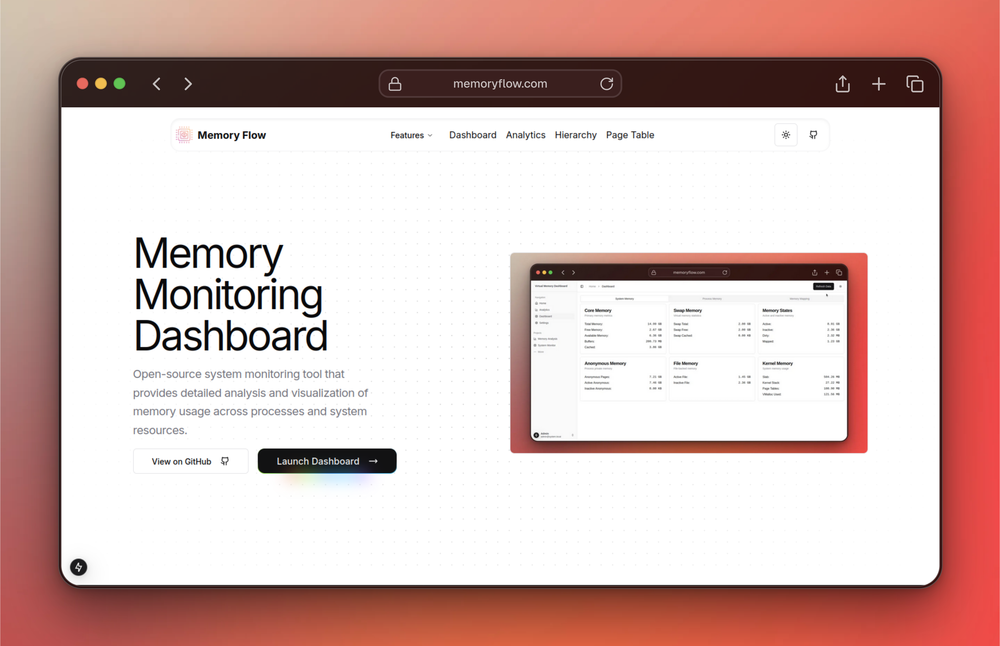
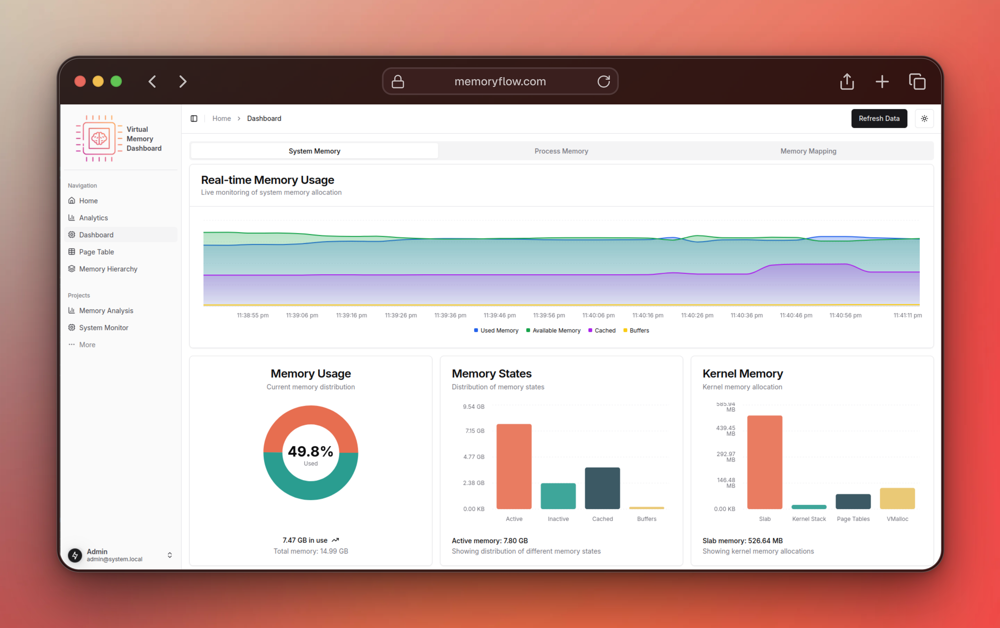
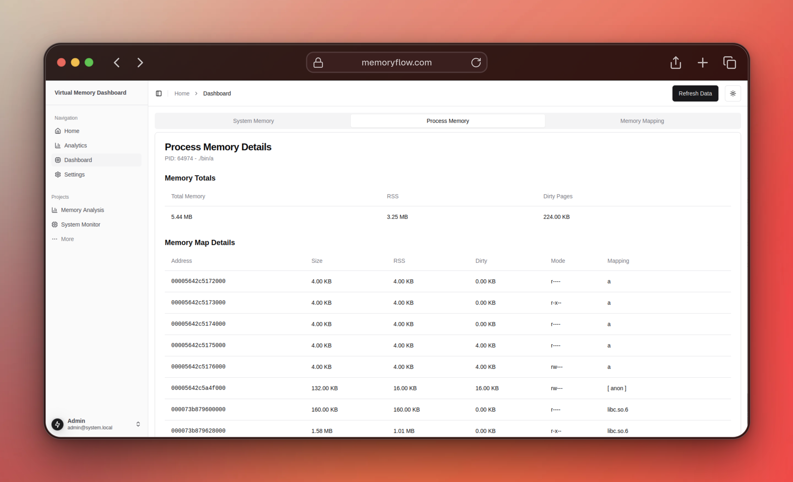
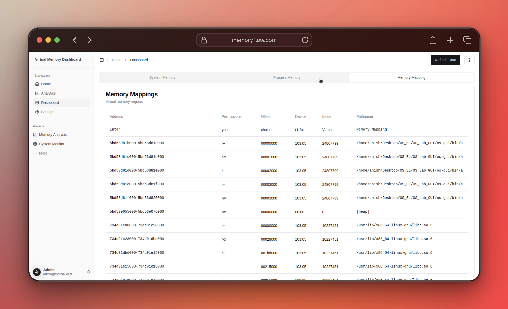
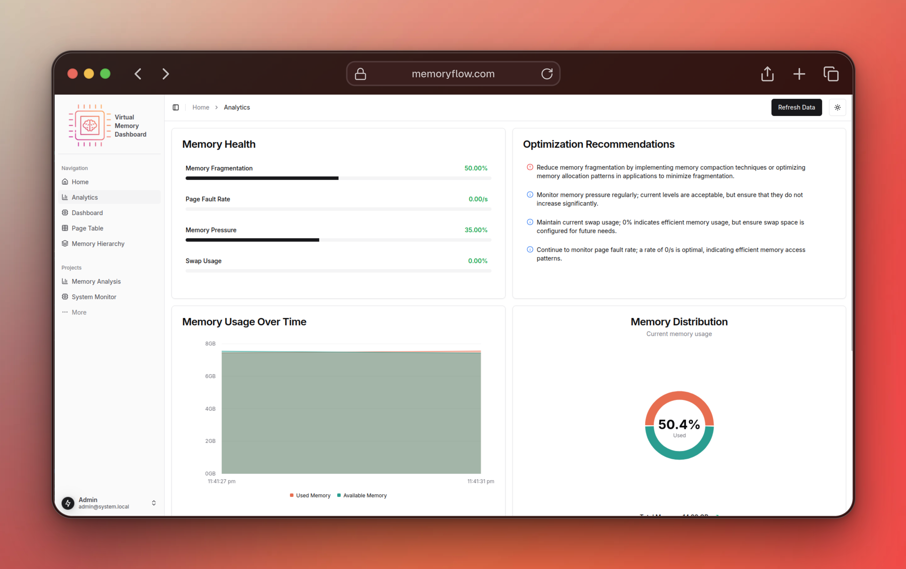

# Virtual Memory Dashboard

A memory monitoring and analysis dashboard built with Next.js and C, providing real-time insights into system and process memory usage.







## Features

- **Real-time Memory Monitoring**
  - System-wide memory statistics
  - Process-specific memory analysis
  - Virtual memory mapping visualization
  - Memory leak detection

- **Advanced Analytics**
  - Memory fragmentation analysis
  - Page fault tracking
  - Memory pressure monitoring
  - Swap usage statistics
  - Interactive timeline visualization
  - Memory health indicators

## Tech Stack

- **Frontend**
  - Next.js 14
  - TypeScript
  - Tailwind CSS

- **Backend**
  - C-based memory analysis program
  - JSON output format

## Prerequisites

NOTE: This project is designed to be run on a Linux machine. Please ensure you have a Linux machine with the necessary dependencies installed. Tested on Ubuntu 22.04.

Before building the project, ensure you have the following dependencies installed:

- Node.js and npm 
- GCC compiler
- pthread library
- json-c library

On Ubuntu/Debian, you can install the C dependencies with:
```bash
sudo apt-get install build-essential libjson-c-dev
```

## Getting Started

1. Clone the repository:

```bash
git clone https://github.com/CubeStar1/memory-flow.git
```

2. First, compile the memory analysis backend:

```bash
cd os-gui/bin
make
```

This will create the `vmd` (Virtual Memory Dashboard) executable.

3. Install the frontend dependencies:

```bash
cd os-gui
npm install
```

4. Run the development server:

```bash
npm run dev
```

5. Open [http://localhost:3000](http://localhost:3000) with your browser to access the dashboard.

## Dashboard Views

### Memory Dashboard (/dashboard)
- System Memory Overview
- Process Memory Analysis
- Memory Mapping Visualization

### Analytics Dashboard (/analytics)
- Memory Health Indicators
- Usage Timeline
- Memory Distribution Charts
- Optimization Recommendations

## API Endpoints

- The dashboard makes API calls to the nextjs server running on the same machine, which periodically (every 5 seconds) runs the `vmd` executable and returns the results in JSON format. 
- The JSON data is then processed by the dashboard to display the memory usage and analysis.

- `/api/memory` - Basic memory statistics
- `/api/analytics` - Advanced memory analytics

## Development

To clean the build:
```bash
cd os-gui/bin
make clean
```

To rebuild the backend:
```bash
cd os-gui/bin
make
```

## Configuration

The dashboard can be configured through environment variables:

```
NEXT_PUBLIC_UPDATE_INTERVAL=5000  # Data refresh interval in milliseconds
NEXT_PUBLIC_MAX_HISTORY=30        # Maximum data points in timeline
```

